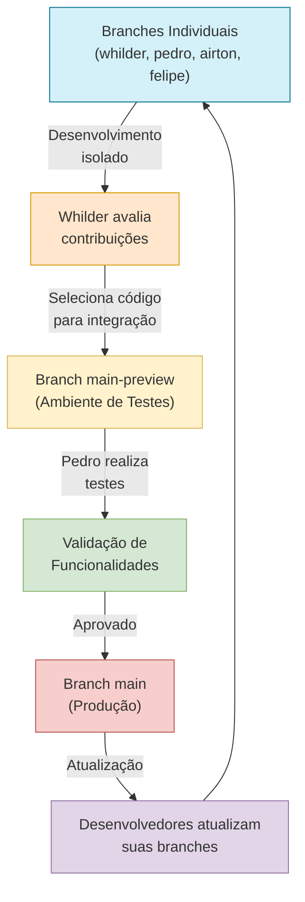

### 📄 Documentação Técnica – Boas Práticas para Não Comprometer o Código dos Colegas

  

## 🎯 Propósito da Documentação

Esta documentação tem como finalidade padronizar as práticas de colaboração entre os desenvolvedores da equipe, garantindo que cada integrante atue de forma organizada, respeitando o espaço de trabalho dos demais e mantendo a integridade e estabilidade do código-fonte.

---

## 👥 Papéis e Responsabilidades

<table>
  <tr>
    <th>Desenvolvedor</th>
    <th>Responsabilidades</th>
  </tr>
  <tr>
    <td><strong>Whilder</strong></td>
    <td>Responsável exclusivo pelas branches <code>main-preview</code> e <code>main</code>. Cabe a ele avaliar e selecionar o que será reaproveitado das branches individuais e realizar as integrações nas branches principais.</td>
  </tr>
  <tr>
    <td><strong>Pedro</strong></td>
    <td>Responsável por executar os testes na branch <code>main-preview</code>, validando funcionalidades e identificando possíveis erros antes da promoção para a produção.</td>
  </tr>
  <tr>
    <td><strong>Whilder, Airton, Felipe e Pedro</strong></td>
    <td>Atuam exclusivamente em suas respectivas branches, contribuindo com novas funcionalidades e melhorias de forma isolada.</td>
  </tr>
</table>

> **Nota:** Todos os quatro integrantes (Whilder, Pedro, Airton e Felipe) são desenvolvedores do projeto.

---

## 🔄 Fluxo de Trabalho

### Detalhamento do Fluxo:

1. **Desenvolvimento Isolado**
   - Cada desenvolvedor possui sua própria branch identificada por seu nome (\`whilder\`, \`pedro\`, \`airton\`, \`felipe\`)
   - Todos devem atuar exclusivamente dentro de suas branches individuais

2. **Avaliação de Contribuições**
   - Whilder é o responsável por revisar o conteúdo das branches individuais
   - Ele decide o que será reaproveitado para integração

3. **Integração para Testes**
   - Após avaliação, Whilder realiza o merge do código selecionado para a branch \`main-preview\`
   - Esta branch funciona como uma versão de testes e pré-lançamento

4. **Validação**
   - Pedro realiza os testes na \`main-preview\`
   - Assegura que as funcionalidades estejam operando corretamente

5. **Promoção para Produção**
   - Uma vez validadas, as alterações são promovidas por Whilder para a branch \`main\`
   - A branch \`main\` representa a versão de produção

6. **Atualização das Branches Individuais**
   - Sempre que a \`main-preview\` for atualizada, todos os desenvolvedores devem importar as alterações
   - Isso mantém os ambientes individuais atualizados com as últimas melhorias

  <strong>⚠️ Importante:</strong> As branches <code>main-preview</code> e <code>main</code> são de acesso exclusivo do Whilder. Nenhum outro desenvolvedor deve fazer alterações diretas nessas branches.

---

## 🏁 Considerações Finais

Esse fluxo garante que o trabalho de cada desenvolvedor será respeitado e que nenhuma contribuição será sobrescrita ou perdida. O cumprimento dessas boas práticas promove:

- ✅ **Organização** no desenvolvimento colaborativo
- ✅ **Responsabilidade** na gestão do código
- ✅ **Segurança** na evolução do projeto
- ✅ **Integridade** das contribuições individuais
- ✅ **Estabilidade** do ambiente de produção

  

    "Código bom é código respeitado. Respeite o trabalho dos seus colegas."
  

